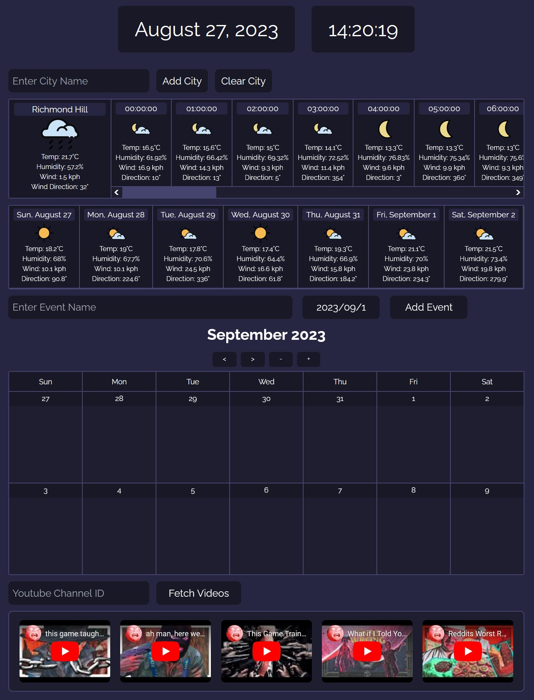

# Project 1 - Personalized Information Hub

## Description

I am an avid internet user, who frequently visits & utilizes various sites and applications for various purposes. However, I am also a *very* busy man, and as such, wish that I could have the functionality of all these apps consolidated into one location for quick and efficient use. This project is meant to fulfill that wish.

Specifically, it combines the functionality of a city-based weather app, a calendar which tracks user-generated events over the short, medium, and long-term, and a menu which retrieves the lastest five uploads from a specific YouTube Channel.

## Usage

Visit the Personalized Information Hub here;

https://scs-bc-project-1-group-1.github.io/personalized-information-hub/

At the top of the page, there will be two blocks, displaying the current date on the left, and the current time (24-hour format) on the right, which will update in real-time.

Below will be an input box and two buttons, which are used to render weather data to the page. After typing a city's name into the input, click "Add City", and an attempt will be made to retrieve the weather data of that city. If successful, the input box will be cleared, and the appropriate city data will be rendered to the page. If the search was not successful, nothing will change. The last successful search will be stored locally, such that the appropriate weather data will be loaded again upon refreshing / reopening the page. A new successful search will overwrite the previous entry. Clicking the "Clear City" button will remove the weather data from the page and clear the city saved in local storage.

The weather data will be split into two sections; today's weather (above), and this week's weather (below). The current weather will be displayed in a larger box on the left, with the name of the city being tracked at the top, with an icon representing weather conditions, temperature, humidity, wind speed, and wind direction following below. To the right will be the hourly forecast for the day, headed by a time signature for the hour followed by the same weather properties as before. There will be a scrollbar to allow scrolling through the various hours of the day. The weekly forecast will appear as per the above hourly forecast, with hours swapped out for days.

Below will be the event creator section of the calendar, composed of two inputs and a button. Type the name of the desired event in the first input, use the datepicker widget to select the associated date in the second input, then click "Add Event" to add it to the calendar. Events will appear as vertically-stacking list items in their associated date block, with a small 'X' button on their right side, which can be clicked to delete the event. All event additions & deletions are saved locally.

Below the event creator will be a header displaying the month / year currently being viewed, along with four buttons; two for traversing left & right, and two for zooming in and out. The calendar has three zoom levels; bi-weekly, monthly, and yearly. In the bi-weekly view, the traverse buttons will move the calendar by one week, by a month in the monthly view, and by a year in yearly. Note that the default date in the datepicker will update to the first of the month / year you are currently viewing.

In the bi-weekly view, events will take up as much space as they need, with their parent week expanding vertically if necessary. In the monthly view, each event will be limited to one line, with any overflow being cut off with an ellipsis, and every day has a fixed height, i.e. events will be cut off if there are too many attached to a single day. In the yearly view, events themselves will not be listed, but any day which has at least one event attached will be highlighted with an alternate text + background colour. Note that you cannot remove events while in the yearly view.

Below is the UI for the YouTube channel tracker, which will fetch and display the five latest videos from a specified YouTube channel, given the ID. Instructions for retrieving a channel's ID can be found below. After inserting the desired channel's ID into the input box, press the "Fetch Videos" button, and the five latest videos from that channel will be displayed in a box below. It will gather video data from Youtube such as details about each video which is then saved in the browser's memory. The script then takes the video data and displays it on the webpage using a window for each video, which is called an "iframe". This "iframe" will show the video itself. The Youtube script that we developed also utilizes local storage so that when you close the page or refresh it will display the previously loaded content instead of pinging the Youtube servers to constantly fetch which would use up your daily 10,000 queries limit. If you fetch videos from one channel and then type in a new channel's ID and fetch again, the script updates the saved video data. This way, the new channel's videos will replace the old ones, but you won't lose the old videos.

### Retreiving a YouTube Channel ID

To retrieve a YouTube channel's ID, first head to the home page of the desired channel to be tracked. Just below the section containing the channel's icon & name will be a navbar leading to various other sections of the channel. Click the section on the far right, "About". In this section, you will see a small "Stats" block on the right, at the bottom of which will be the "Share" button, represented by a small icon of an arrow which goes up & then to the right. Click it, and then click the "Copy channel ID" option in the menu that appears. This will copy the channel's ID to your clipboard, which can then be pasted into the channel ID input box.

## Preview

## Credits

### ETHAN'S LINKS

offsetHeight (./assets/scripts/script.js, lines 248-249);
https://stackoverflow.com/questions/294250/how-do-i-retrieve-an-html-elements-actual-width-and-height

input readonly (./index.html, line 65);
https://stackoverflow.com/questions/4164542/how-to-disable-manual-input-for-jquery-ui-datepicker-field

jQuery datepicker (./assets/scripts/script.js, lines 295, 301, 516, 528);
https://api.jqueryui.com/datepicker/

.index() syntax (./assets/scripts/script.js, line 479);
https://stackoverflow.com/questions/28952509/jquery-how-to-get-the-index-of-an-element-in-the-selection-array

onload Event syntax (./assets/scripts/script.js, line 526);
https://www.w3schools.com/jsref/event_onload.asp

#### Icon stuff (./assets/images/favicon.png)

linked triangle (icon base)
https://www.veryicon.com/icons/education-technology/big-data-1/porana-data.html

calendar (icon part)
https://www.nicepng.com/ourpic/u2q8a9r5r5u2a9e6_calendar-comments-calendar-icon-vector-png/

sun & cloud (icon part)
https://www.flaticon.com/free-icons/sun

video player (icon part)
https://www.flaticon.com/free-icons/video

### WESLEY'S LINKS

https://developer.mozilla.org/en-US/docs/Web/JavaScript/Reference/Statements/throw

https://developer.mozilla.org/en-US/docs/Web/API/Response

https://www.w3schools.com/js/js_errors.asp

https://www.freecodecamp.org/news/use-svg-images-in-css-html/#:~:text=SVG%20images%20can%20be%20written,element%20in%20your%20HTML%20document.&text=body%3E-,If%20you%20did%20everything%20correctly%2C%20your%20webpage%20should,exactly%20like%20the%20demo%20below.

https://forum.freecodecamp.org/t/how-to-get-and-post-the-icons-from-open-weather-api-to-html/23180/4

### STAVROS' LINKS

https://blog.logrocket.com/localstorage-javascript-complete-guide/

https://stackoverflow.com/questions/57266921/how-to-get-youtube-video-url-from-channel-id

https://developer.mozilla.org/en-US/docs/Learn/JavaScript

https://developers.google.com/youtube/v3/docs/videos#methods

https://stackoverflow.com/questions/45141465/how-to-get-the-data-of-a-video-from-youtube-in-javascript

https://developers.google.com/youtube/iframe_api_reference

https://www.w3schools.com/jsref/event_onload.asp

https://developer.mozilla.org/en-US/docs/Web/JavaScript

## License

Operates under a standard MIT license, refer to the LICENSE file in the repository for more information.